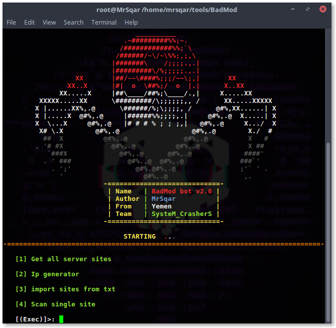
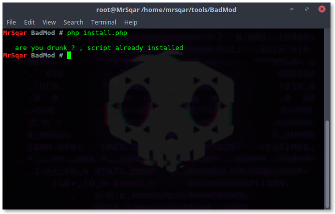
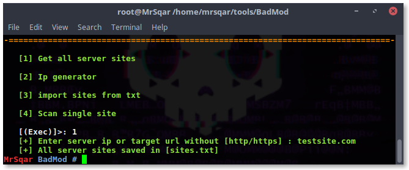
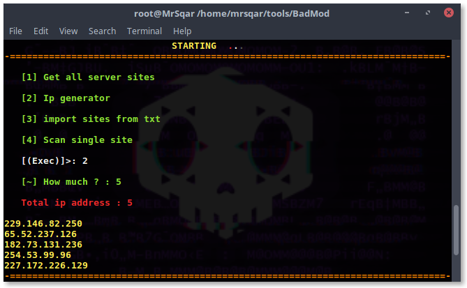

<h1> BadMod auto exploit tool </h1>
 
<h2>Version 2.0</h2>
<ul> 
<li>Fixed colors bug</li>
<li>Fixed permissions bug</li>
<li>Added new option to scan single target</li>
<li>Added new option to scan joomla & wordpress plugins</li>
</ul>
 
<h2>Installation</h2>
<ul> 
<li>Install tool</li>
<code>git clone https://github.com/MrSqar-Ye/BadMod.git</code>
<li>Install php</li>
<code>sudo apt-get install php</code>
<li>Install php curl</li>
<code>sudo apt-get install php-curl</code>
</ul>
 
<h2>Screen shots</h2>
 

<h3>Header</h3> 
 

 

 
<h3>Installation</h3> 
 
  <code>chmod +x INSTALL</code>
   <code>./INSTALL</code>

 
<h3>Option 1 - Get all server sites</h3> 
<ul> 
<li>Fast tool to get all server sites .</li>
</ul>
 

 

<h3>Option 2 - generate random IP's</h3> 
 

 

<h2>Video</h2> 
 

 

<h2>Report bug.</h2>
<ul>
<li>Submit new issue</li>
<li>Send to my <a href="mailto:mrsqar@gmail.com">Email</a></li>
</ul>
 
<h4>i Hope you like the tool, <3 :D :)</h4>
